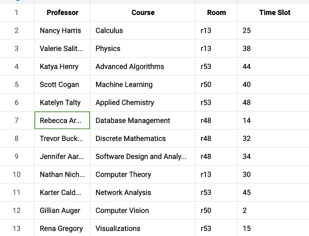
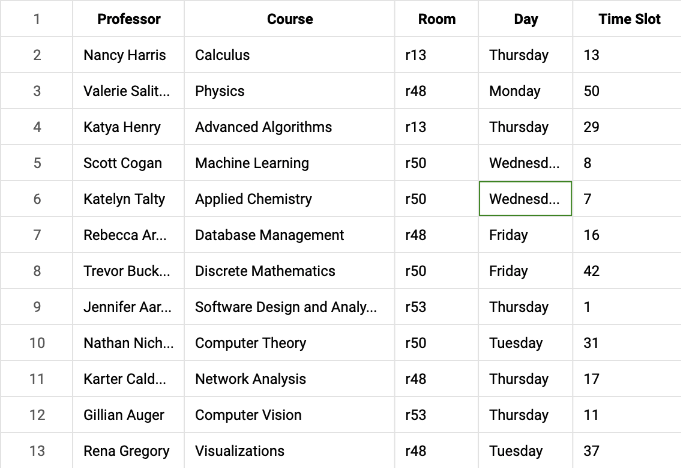
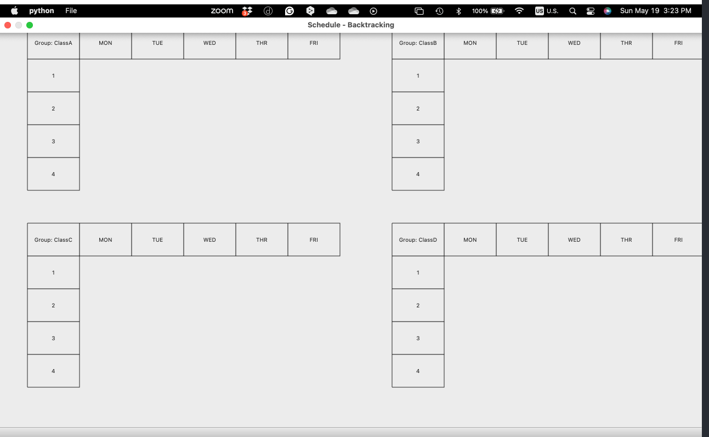
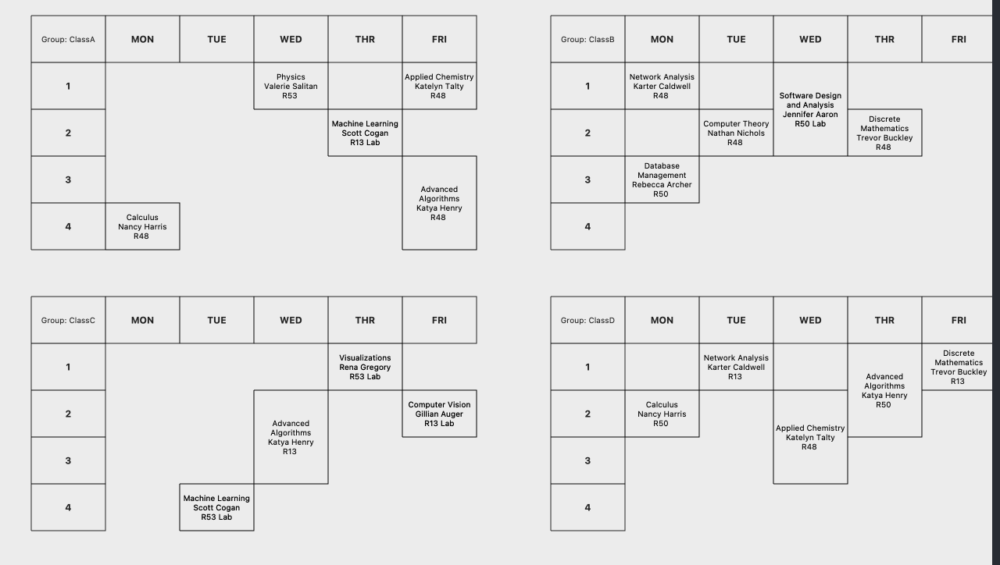

# Report for Scheduling Optimization Project--ETI

Members: Nan Jia and Rida Sohail

## Project Overview

This project aims to optimize the scheduling of professors, courses, and rooms in an educational institution using different algorithms, including Generic Algorithm (GA), Simulated Annealing (SA) and Constraint Satisfaction Problem (CSP) approaches. The goal is to generate a conflict-free schedule that meets the institution's constraints and requirements.

## Problem Descriptions

The scheduling problem involves assigning professors to courses in specific rooms at specific times, ensuring that no conflicts occur.

Each variable represents an aspect of the schedule that needs to be decided. Common variables in school scheduling include:

- `Class_i`: Represents the timeslot and room assigned for the i-th class.
- `Teacher_j`: Represents the timeslot assigned for the j-th teacher.
- `Room_k`: Represents the availability status (occupied or free) for the k-th room at each timeslot.

Domains:
The domain of a variable is the set of all possible values it can take. For a school schedule:

- `Timeslot`: All possible school hours divided into class periods (e.g., Period 1, Period 2, ..., Period N).
- `Room`: All available classrooms and special rooms (e.g., Room 101, Lab 1, Gym, etc.).
- `Teacher`: All teaching staff available to teach (e.g., Teacher A, Teacher B, etc.).

Constraints:
Constraints are rules that must be adhered to when assigning values to variables. They ensure that the schedule is practical and meets all requirements:

1. Time Constraints:

   - `Class_i ∈ Timeslot`: Each class must be assigned to a valid timeslot.
   - `Class_i.duration <= School hours`: Class duration must not exceed school operational hours.
2. Resource Constraints:

   - `Class_i.room = Room_k AND Room_k.status = 'occupied'`: Each class is assigned to a room, and that room is marked as occupied during the class.
   - `Teacher_j NOT IN Class_i AND Class_k IF Timeslot_i = Timeslot_k`: A teacher cannot be in two places at once; no overlapping classes for teachers.
3. Curriculum Constraints:

   - `Class_i.prerequisites = {Class_a, Class_b, ...}`: Certain classes must precede others.
   - `Student_l.classes = {Class_i, Class_j, ...}` WITHOUT overlap: Ensure students can attend all enrolled classes without schedule conflicts.

## Team Members Roles

- Rida Sohail:
  - Implemented the Genetic Algorithm for scheduling optimization.
  - Constructed GUI for whole project.
  - Configured the data file
- Nan Jia:
  - Implemented the Simulated Annealing algorithm for scheduling optimization.
  - Developed the data and functions for generating an initial schedule, calculating the objective function, and generating neighboring solutions.
  - Translated the schedule to a human-readable format and saved it to a CSV file.
  - Integrated results into GUI and generated reports.

## Approach

### 1. Genetic Algorithm (GA)

### 2. Simulated Annealing (SA)

Simulated Annealing is a probabilistic technique for approximating the global optimum of a given function. It is particularly useful for large search spaces and complex optimization problems.

#### Key Components:

- **Initial Schedule Generation**: A random initial schedule is generated.
- **Objective Function**: Evaluates the quality of the schedule based on conflicts.
- **Neighbor Solution**: Generates neighboring solutions by making slight changes to the current schedule.
- **Acceptance Probability**: Determines whether to accept a worse solution to escape local minima.
- **Annealing Schedule**: Controls the cooling rate and stopping criteria.

### 3. Constraint Satisfaction Problem (CSP)

CSP is a mathematical problem defined by a set of objects whose state must satisfy a number of constraints. CSP can be solved using backtracking algorithms with heuristics and constraint propagation.

#### Key Components:

- **Variables**: Represents the entities to be assigned (e.g., professor-course pairs).
- **Domains**: Represents the possible values for the variables (e.g., available rooms and time slots).
- **Constraints**: Rules that must be satisfied for a solution to be valid (e.g., no overlapping classes for a professor).

## Experiments

### Configuration File (`data.cfg`)

The configuration file contains all the necessary data, including:

- **Professors**: List of professors and their IDs.
- **Courses**: List of courses and their IDs.
- **Rooms**: Room availability and capacity.
- **Groups**: Group information.
- **Classes**: Class schedules.

### Simulated Annealing Implementation (`simulated_annealing.py`)

#### Main Functions:

- **initialize_schedule()**: Generates an initial random schedule.
- **objective_function(schedule)**: Calculates the number of conflicts in the schedule.
- **neighbor_solution(schedule)**: Produces a neighboring solution by altering the current schedule.
- **acceptance_probability(current_value, new_value, temperature)**: Determines whether to accept a new solution.
- **simulated_annealing()**: Orchestrates the simulated annealing process.

#### Translation and Saving:

- **translate_schedule(best_schedule)**: Translates the schedule to a human-readable format.
- **save_schedule_to_csv(schedule, file_path)**: Saves the translated schedule to a CSV file.

### CSP Implementation (`backtracking.py`)

#### Main Functions:

- **CSP Class**: Handles the variables, domains, and constraints for the CSP.
- **no_teacher_overlap()**: Ensures no teacher has overlapping classes.
- **no_room_overlap()**: Ensures no room has overlapping classes.
- **iterative_backtracking_search()**: Performs iterative backtracking to find a solution.
- **iterative_backtracking_search_relaxed()**: Attempts to find a solution with relaxed constraints.
  To resolve the conflicts, we considered the following strategies:

1. Increase the number of rooms or adjust room availability to accommodate more classes.
2. Consider relaxing some constraints, if possible, to find a feasible schedule.
3. Implement advanced scheduling algorithms such as Simulated Annealing, Genetic Algorithms, or Constraint Satisfaction Problem (CSP) solvers to generate conflict-free schedules.

### Validation Script (`validate.py`)

The validation script ensures the generated schedule is conflict-free.

#### Main Functions:

- **validate_schedule(schedule)**: Checks for conflicts in the schedule.
- **load_schedule_from_csv(file_path)**: Loads the schedule from a CSV file.

### Report Generation (`generate_report.py`)

Generates a detailed report of the scheduling process and validation results.

#### Main Functions:

- **generate_report(schedule_file, report_file)**: Generates a report based on the schedule and validation results.

## Results

### Schedule Generation

The schedule is generated using Simulated Annealing, and in case of failure, iterative backtracking with heuristics and relaxed constraints is used. The final schedule is saved to a CSV file.

Schedule generated by Simulated Annealing:

Schedule generated by iterative backtracking:
Sometimes the backtracking algorithm may not find a feasible solution due to the complexity of the constraints. In such cases, either a relaxed version of the constraints is used, or a hybrid approach with Simulated Annealing is employed.

Best schedule saved to CSV: ../output/best_schedule_20240516-211254.csv
Solution found using: Backtracking with Relaxed Constraints

### Validation

The generated schedule is validated using the `validate.py` script. Any conflicts detected are reported, and the validation result is included in the report.

(base) nanspro@Nans-MBP src % python validate.py ../output/best_schedule_20240516-211254.csv
Conflict detected for Professor Nancy Harris at ('Tuesday', '50')
The schedule has conflicts.

## Lessons Learned/AI ethics

This project has provided valuable insights into the challenges of scheduling optimization in educational institutions. The use of AI algorithms like Simulated Annealing and CSP has shown promise in generating conflict-free schedules. However, there are several ethical considerations to keep in mind:

1. **Fairness**: Ensure that the scheduling algorithm does not favor certain professors or courses over others.
2. **Transparency**: Make the scheduling process transparent to all stakeholders, including professors, students, and administrators.
3. **Privacy**: Protect the privacy of professors and students by not sharing sensitive information in the schedule.
4. **Bias**: Be aware of any biases in the scheduling algorithm that may disadvantage certain groups or individuals.
5. **Accountability**: Ensure that the scheduling algorithm is accountable for its decisions and can be reviewed and audited if needed.

In summary, while AI algorithms can help optimize scheduling processes, it is essential to consider ethical implications and ensure that the scheduling system is fair, transparent, and accountable.

## Conclusion

This project successfully implements scheduling optimization using Simulated Annealing and CSP approaches. The schedules are validated to ensure they are conflict-free, and detailed reports are generated for transparency and review.

---

This report provides a comprehensive overview of your scheduling optimization project, covering all critical aspects from methodology to implementation and validation.

## Chanllenges faced and future work

1. **Complexity**: The scheduling problem is inherently complex due to the large search space and numerous constraints. Future work could focus on refining the constraints and heuristics to improve scheduling efficiency.
2. **Scalability**: Scaling the scheduling algorithm to handle larger datasets and more complex constraints is a significant challenge. Future work could explore parallel processing and distributed computing to improve scalability.
3. **Real-world Integration**: Integrating the scheduling algorithm with real-world educational institutions poses challenges in terms of data integration, system compatibility, and user acceptance. Future work could involve pilot testing and user feedback to refine the scheduling system.
4. **Optimization**: Further optimization of the scheduling algorithm using advanced AI techniques such as deep learning and reinforcement learning could enhance scheduling efficiency and accuracy.
